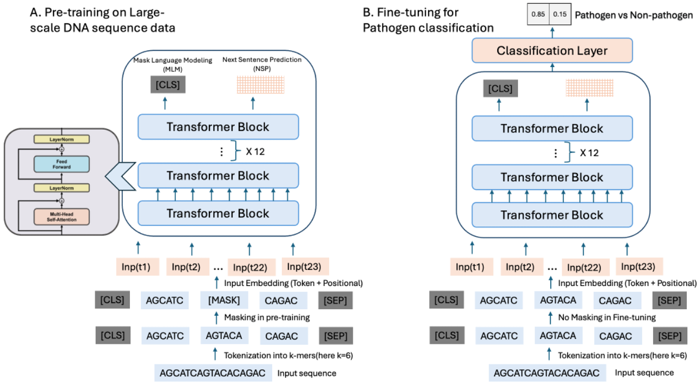

# PathoLM: Identifying Pathogenicity From the DNA Sequence Through the Genome Foundation Model
- Accepted in [MLCB2024]([url](https://proceedings.mlr.press/v261/)) (Spotlight), [ICML AI4Science2024]([url](https://openreview.net/forum?id=f2b7Bozk3O))
Pathogen identification is pivotal in diagnosing, treating, and preventing diseases, crucial for controlling infections and safeguarding public health. Traditional alignment-based methods, though widely used, are computationally intense and reliant on extensive reference databases, often failing to detect novel pathogens due to their low sensitivity and specificity. Similarly, conventional machine learning techniques, while promising, require large annotated datasets and extensive feature engineering and are prone to overfitting. Addressing these challenges, we introduce PathoLM, a cutting-edge pathogen language model optimized for the identification of pathogenicity in bacterial and viral sequences. Leveraging the strengths of pre-trained DNA models such as the Nucleotide Transformer, PathoLM requires minimal data for fine-tuning, thereby enhancing pathogen detection capabilities. It effectively captures a broader genomic context, significantly improving the identification of novel and divergent pathogens. We developed a comprehensive data set comprising approximately 30 species of viruses and bacteria, including ESKAPEE pathogens, seven notably virulent bacterial strains resistant to antibiotics. Additionally, we curated a species classification dataset centered specifically on the ESKAPEE group. In comparative assessments, PathoLM dramatically outperforms existing models like DciPatho, demonstrating robust zero-shot and few-shot capabilities. Furthermore, we expanded PathoLM-Sp for ESKAPEE species classification, where it showed superior performance compared to other advanced deep learning methods, despite the complexities of the task.




## Setup

### Install Dependencies

```
pip install -r requirements.txt
```

## Input File Format

The input file should be in FASTA format. Each sequence entry should contain a header line starting with** **`<span>></span>` followed by metadata, and a sequence line containing the DNA sequence.

### Example:

```
>unique_id species:SpeciesName|sequence_length:XXXXX|label:pathogen
ATGCTAGCTAGCTGATCGATCGATCGATCGTACGTAGCTAGCTGATCG
```

Each header should contain:

* `<span>unique_id</span>`: A unique identifier for the sequence
* `<span>species</span>`: The species name
* `<span>sequence_length</span>`: The length of the DNA sequence
* `<span>label</span>`: The classification label (e.g.,** **`<span>pathogen</span>` or** **`<span>non-pathogen</span>`)

Ensure that each sequence entry follows this format to be correctly parsed by the model.

## Model Weights Download

The model weights are not included in this repository due to their large size. Please download the model weights from Zenodo:

[Download Model Weights](https://zenodo.org/records/14791889)

### Steps to Use:

1. Download the model weights from the above Zenodo link.
2. Create a directory named** **`<span>ckpt</span>` in the repository:
   ```
   mkdir ckpt
   ```
3. Move the downloaded model weight files into the** **`<span>ckpt</span>` directory.
4. Run the evaluation script as described in the usage section.

## Usage

### Evaluate on Test Dataset

```
python eval_model.py --model_path ckpt/patholm_binary_2k_mmseq40 --test_file test.fasta
```

### Evaluate Single Sequence

```
python eval_model.py --model_path ckpt/patholm_binary_2k_mmseq40 --sequence "AGCTGATCG..."
```
